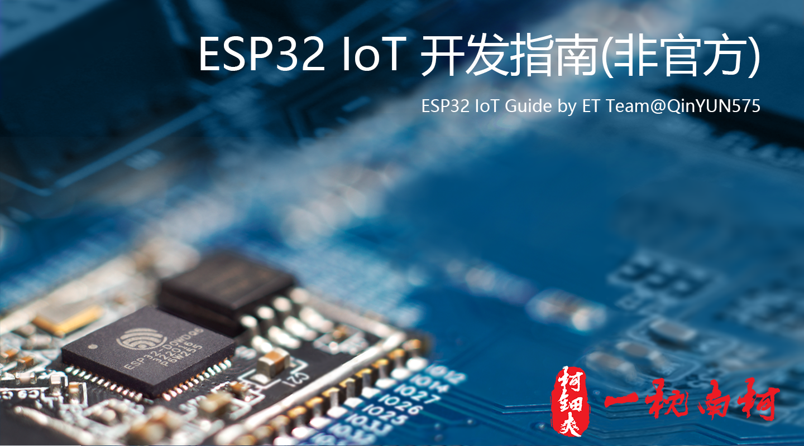

# ESP32 IoT 开发指南


本系列文章由 **ET Team**@[QinYUN575](https://qinyun575.cn) 为 ESP32 在物联网的实际应用开发而撰写

---

> 优秀的人总是有共同之处 —— 努力，孜孜不倦的往自己的方向前行。
>
> “不积跬步无以至千里”， 共励共勉！

- 如果本系列文章对你有帮助，请动动小手分享给你的朋友，谢谢！

<p align="right">—— 码于 三月三号 二零一九年</p>
<p align="right">更新时间 V0.2@20191128</p>

```
**[terminal]
**[prompt foo@joe]**[path ~]**[delimiter  $ ]**[command ./myscript]
Normal output line. Nothing special here...
But...
You can add some colors. What about a warning message?
**[warning [WARNING] The color depends on the theme. Could look normal too]
What about an error message?
**[error [ERROR] This is not the error you are looking for]
```

- GitHub@[QinYUN575](https://github.com/qinyun575)
- Blog@[柯钿爽的个人博客](https://qinyun575.cn)

---

> ESP32 IoT Guide by ET Team@QinYUN575