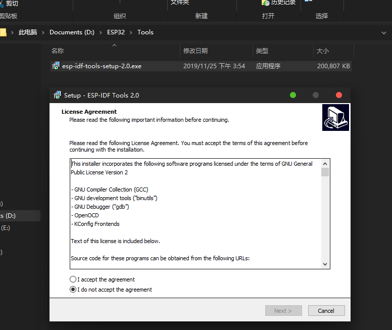
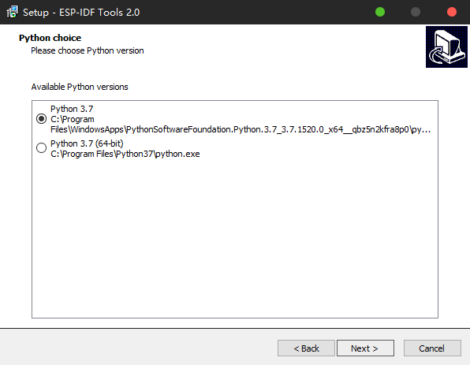
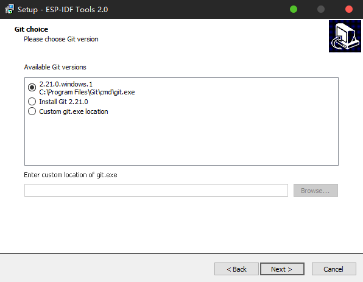
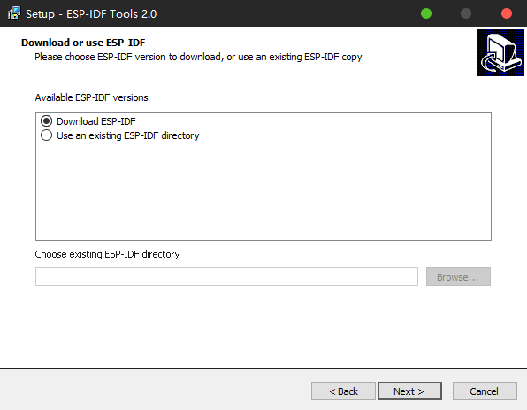
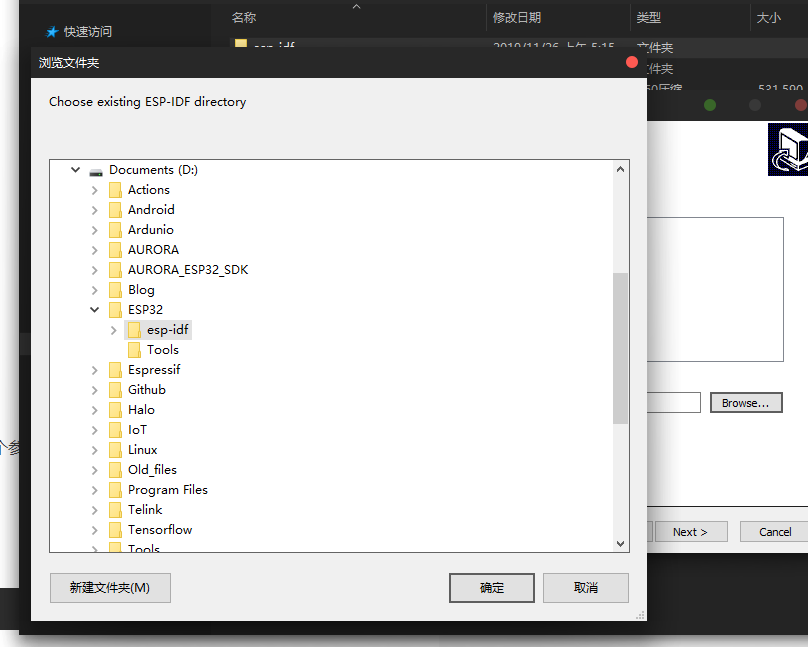
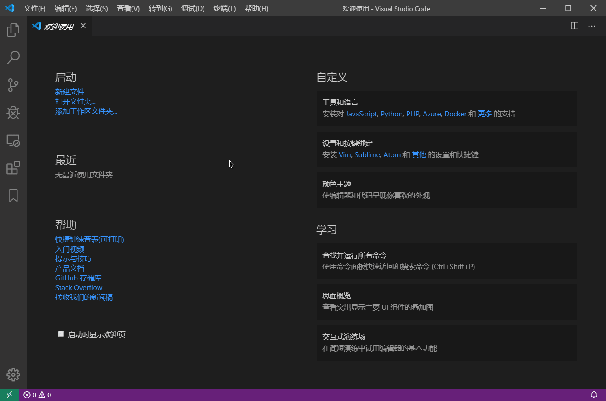

## 一、前言

**摘要:**

由于大部分嵌入式/MCU 开发工程师都是在 Windows 进行开发的,所以乐鑫推出了适用于 Windows 上搭建 ESP32 开发环境的安装器 `ESP-IDF 工具安装器(ESP-IDF-tools-setup)`
我们可以使用 ESP-IDF 安装器 + VS Code 搭建 ESP32 开发环境 来快速搭建 ESP32 开发环境

## 二、下载安装 ESP-IDF-Tools-Setup

ESP-IDF 安装器 下载地址:
[https://dl.espressif.com/dl/esp-idf-tools-setup-2.0.exe](https://dl.espressif.com/dl/esp-idf-tools-setup-2.0.exe)

### 使用 ESP-IDF 安装器安装 ESP32 依赖环境

1. 以管理员身份运行 `esp-idf-tools-setup-2.0.exe`

1. 接受许可



2. 选择安装 Python



3. 选择安装 git




4. 下载/选择 ESP-IDF 目录



由于我们这里使用的是 Release/V4.0 版本,安装器会从 GitHub 上下载 esp-idf, 而 GitHub 由于某些原因在国内的下载速度异常感人,所以我们这里从 gitee(码云)/百度云 下载 esp-idf 的镜像

[百度云下载(链接：https://pan.baidu.com/s/1CCkClgQ1eu9vJ-o5Rx2sCQ
提取码：bd30)](https://pan.baidu.com/s/1CCkClgQ1eu9vJ-o5Rx2sCQ)

下载之后使用 360压缩软件 解压到指定目录,然后使用 ESP-IDF 安装器选定该目录


## 三、VScode 编译运行 ESP32 例程


1. 下载并安装 VSCode, 并将配置终端为 CMD, 及配置终端参数

`Ctrl+Shfit+P` 打开命令面板,输入 `shell` 选择 `CMD` 然后回车,
`Ctrl+\`` 即可打开 VS Code 终端窗口.


```json
{
  "terminal.integrated.shell.windows": "C:\\Windows\\System32\\cmd.exe",
  "terminal.integrated.shellArgs.windows": [
      "/k",
      " D:\\ESP32\\.espressif\\idf_cmd_init.bat C:\\Program Files\\Python37 C:\\Program Files\\Git\\cmd"
  ]
}
```




编译示例工程

#### idf.py 相关命令

查看 idf.py 支持命令: `idf.py --help`

修改工程配置: `idf.py menuconfig`

编译工程: `idf.py build`

全编译工程(重新编译): `idf.py all`

编译下载到指定串口: `idf.py -p COM1 flash`

编译下载并查看: `idf.py -p COM1 flash monitor`


### 在 VSCode 中编译运行 HelloWorld

在 ESP-IDF 目录中右键选择 ''